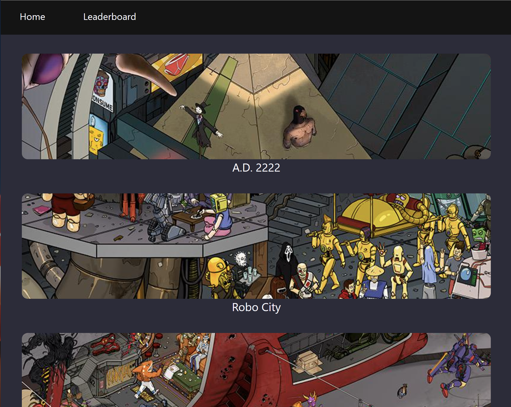

# Where's Waldo Clone

## Description
This project was made using React. Check it out here: [https://character-finder-5efb0.web.app/]

Level art is from Egor Kyluchnyk, [Anomaly-World.com](http://anomaly-world.com).

The backend is hosted on Firebase: [Firebase site](https://firebase.google.com). 

## Playing the Game
To play, simply choose a level. The level screen will present you with a character to find. The goal is to find as many characters as you can before time runs out. 

You can record your score in the leaderboards to see how others ranked. 

## Background
This is a simple practice project to help build skills with React and creating a hosted a site with a backend. The backend in this case includes two types of NoSQL databases and a cloud storage service.

## Challenges // Lessons Learned
### Detecting Which Character Was Clicked
I had a lot of fun putting this together. When I was planning out the project, I anticipated that the hardest part would be determining if the user clicked a character in the image. 

If this app were only running on the front end, an HTML image tag `map` could've been used to define clickable areas. The problem with this is that someone could just open the front-end code and see the coordinates.

I ended up finding an algorithm for how to approach detecting if a click happened. Basically, the code takes the coordinates of the point that was clicked and draws a line out from that point. It then sees how many times this line intersects the character polygon. If it intersects an even number of times, the spot was outside of the polygon. If it intersects an odd number of times, then it must have been inside.

This method works with any shape of polygon, not just simple shapes like squares. It also works with, for example, C-shaped polygons. 

### Managing 
What actually ended up being the more challenging part of the project was managing state in React. From previous projects, I thought I had a decent handle on this. I definitely ended up learning a lot though. 

The most challening part was keeping track of what characters had been found, and then giving another random character to find.

The problem was that I was trying to modify the existing array of found characters, rather than returning a whole new array. This is basic useState stuff but I still managed to trip myself up on it. 

## Conclusion
Anyway, it was a fun project and I hope you enjoy finding a way to break it!
